# 📊 Norton E-Library — Architecture & Design Diagrams

> **Version:** 1.3  
> **Created:** April 2, 2026  
> **Last Updated:** April 24, 2026  
> **Based on:** [PRD.md](PRD.md) · [PLAN.md](PLAN.md)  
> **Rendering:** [Mermaid](https://mermaid.js.org) — use GitHub, VS Code Mermaid Preview, or any Mermaid-compatible viewer.

---

## Table of Contents

1. [System Architecture Overview](#1-system-architecture-overview)
2. [Deployment Architecture](#2-deployment-architecture)
3. [Entity-Relationship Diagram](#3-entity-relationship-diagram)
4. [Authentication — Token Flow](#4-authentication--token-flow)
5. [Password Reset — OTP Flow](#5-password-reset--otp-flow)
6. [RBAC Authorization Flow](#6-rbac-authorization-flow)
7. [File Upload & Storage Flow](#7-file-upload--storage-flow)
8. [PDF Reading Flow](#8-pdf-reading-flow)
9. [AI Recommendation Flow](#9-ai-recommendation-flow)
10. [API Route Structure](#10-api-route-structure)
11. [Admin Dashboard — Page Structure](#11-admin-dashboard--page-structure)
12. [Student Frontend — Page Structure](#12-student-frontend--page-structure)
13. [Redux State Architecture](#13-redux-state-architecture)
14. [Sprint & Phase Timeline](#14-sprint--phase-timeline)
16. [Level 0 DFD — Admin, Librarian & Student](#16-level-0-dfd--admin-librarian--student)
17. [Level 0 DFD — Admin & Librarian Flowchart](#17-level-0-dfd--admin--librarian-flowchart)
18. [Level 0 DFD — User / Student Detailed Process Flow](#18-level-0-dfd--user--student-detailed-process-flow)

---

## 1. System Architecture Overview

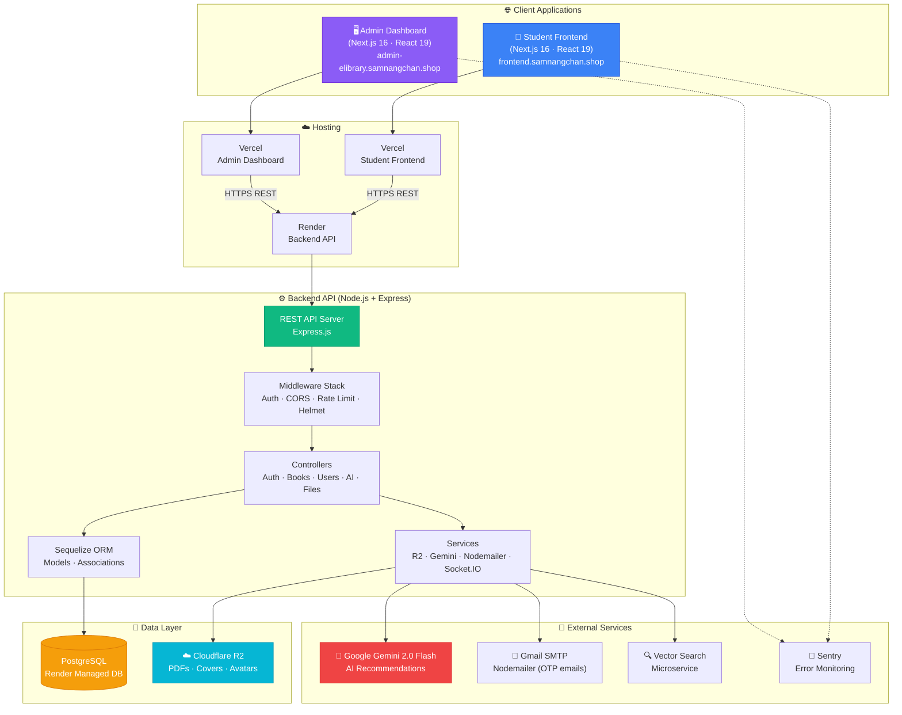

---

## 2. Deployment Architecture

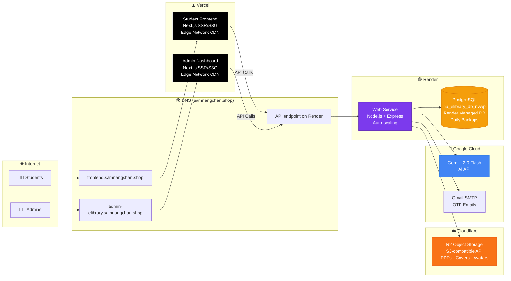

---

## 3. Entity-Relationship Diagram

```mermaid
erDiagram
    User {
        bigint id PK
        string username UK
        string email UK
        string student_id UK
        string password
        string avatar
        string oauth_provider
        string oauth_id
        boolean is_active
        boolean is_email_verified
        boolean two_factor_enabled
        boolean is_deleted
    }

    Role {
        bigint id PK
        string name UK
        string description
    }

    Permission {
        bigint id PK
        string name UK
        string description
    }

    Book {
        bigint id PK
        string title
        string title_kh
        string isbn UK
        text description
        string language
        int publication_year
        int pages
        string cover_url
        string pdf_url
        jsonb pdf_urls
        int views
        int downloads
        boolean is_active
        boolean is_deleted
        int publisher_id FK
        int category_id FK
        int department_id FK
        int type_id FK
    }

    Author {
        int id PK
        string name
        string name_kh
        text biography
    }

    Editor {
        int id PK
        string name
        string name_kh
        text biography
    }

    Publisher {
        int id PK
        string name
        string name_kh
        string address
        string contact_email
    }

    Category {
        int id PK
        string name UK
        string name_kh
        string description
    }

    Department {
        int id PK
        string code UK
        string name UK
        string name_kh
        string description
    }

    MaterialType {
        int id PK
        string name UK
        string name_kh
        string description
    }

    Download {
        bigint id PK
        bigint user_id FK
        bigint book_id FK
        datetime downloaded_at
        string ip_address
    }

    Activity {
        bigint id PK
        bigint user_id FK
        string action
        string target_type
        bigint target_id
        json details
        string ip_address
        datetime created_at
    }

    Review {
        bigint id PK
        bigint book_id FK
        bigint user_id FK
        int rating
        text comment
        boolean is_deleted
    }

    Feedback {
        bigint id PK
        bigint user_id FK
        enum type
        string subject
        text message
        int rating
        enum status
        bigint resolved_by FK
        datetime resolved_at
    }

    PushSubscription {
        bigint id PK
        bigint user_id FK
        text endpoint UK
        json keys
    }

    Setting {
        int id PK
        string key UK
        text value
    }

    %% Junction Tables
    UsersRoles {
        bigint user_id FK
        bigint role_id FK
    }

    RolesPermissions {
        bigint role_id FK
        bigint permission_id FK
    }

    UsersPermissions {
        bigint user_id FK
        bigint permission_id FK
    }

    BookAuthor {
        bigint book_id FK
        int author_id FK
        boolean is_primary_author
    }

    BookEditor {
        bigint book_id FK
        int editor_id FK
    }

    PublishersBooks {
        int publisher_id FK
        bigint book_id FK
    }

    %% Relationships
    User ||--o{ UsersRoles : "has"
    Role ||--o{ UsersRoles : "assigned to"
    Role ||--o{ RolesPermissions : "grants"
    Permission ||--o{ RolesPermissions : "granted by"
    User ||--o{ UsersPermissions : "has direct"
    Permission ||--o{ UsersPermissions : "assigned to"

    Book ||--o{ BookAuthor : "written by"
    Author ||--o{ BookAuthor : "writes"
    Book ||--o{ BookEditor : "edited by"
    Editor ||--o{ BookEditor : "edits"
    Book ||--o{ PublishersBooks : "published by"
    Publisher ||--o{ PublishersBooks : "publishes"

    Book }o--|| Category : "belongs to"
    Book }o--|| Department : "belongs to"
    Book }o--|| MaterialType : "typed as"
    Book }o--|| Publisher : "primary publisher"

    User ||--o{ Download : "downloads"
    Book ||--o{ Download : "downloaded"
    User ||--o{ Activity : "performs"
    User ||--o{ Review : "writes"
    Book ||--o{ Review : "receives"
    User ||--o{ PushSubscription : "subscribes"
    User ||--o{ Feedback : "submits"
    User ||--o{ Feedback : "resolves"
```

---

## 4. Authentication — Token Flow

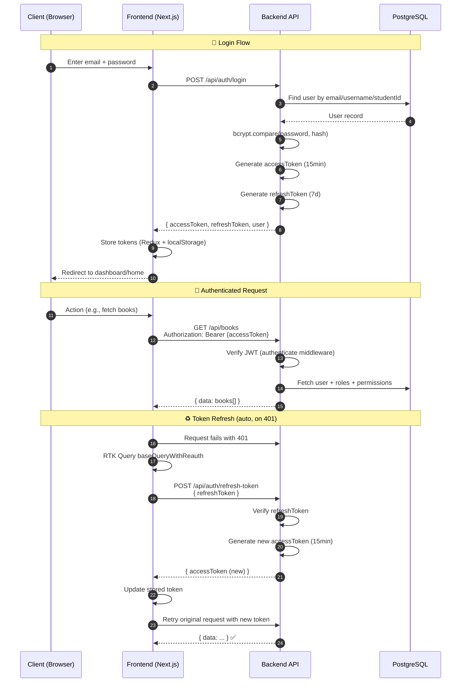

---

## 5. Password Reset — OTP Flow

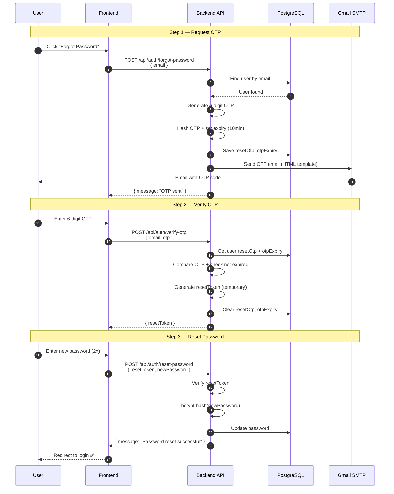

---

## 6. RBAC Authorization Flow

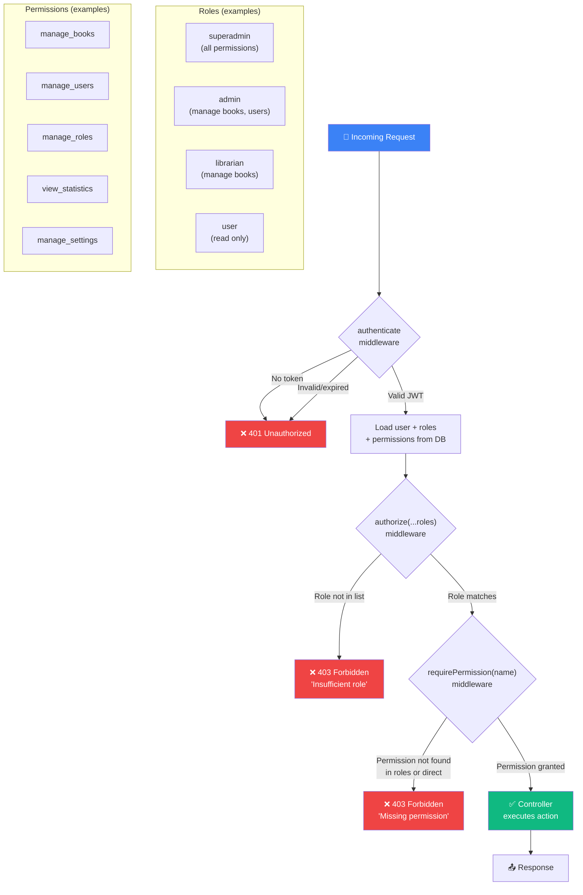

---

## 7. File Upload & Storage Flow

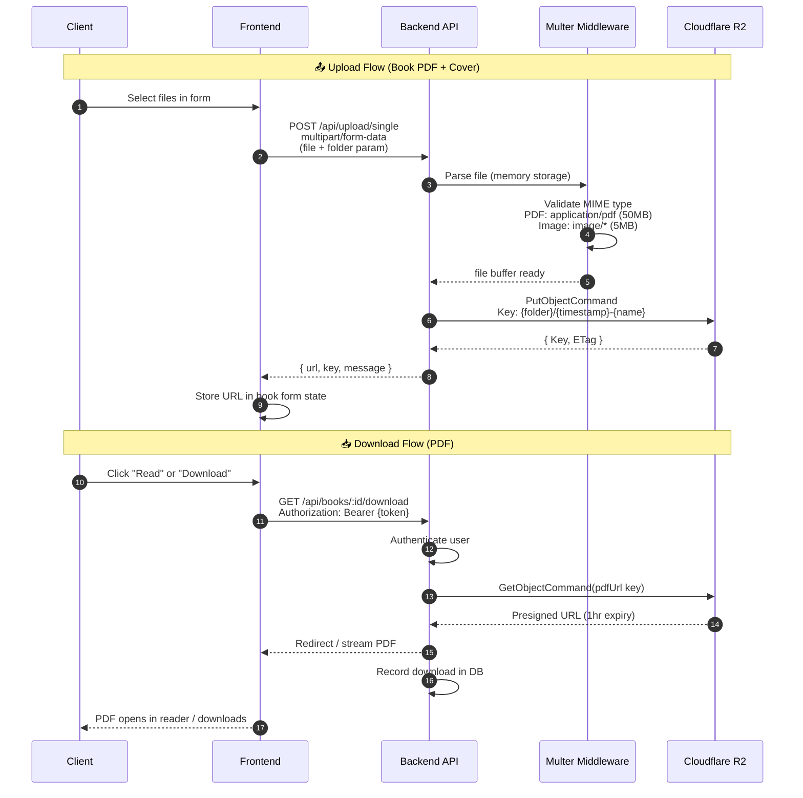

---

## 8. PDF Reading Flow

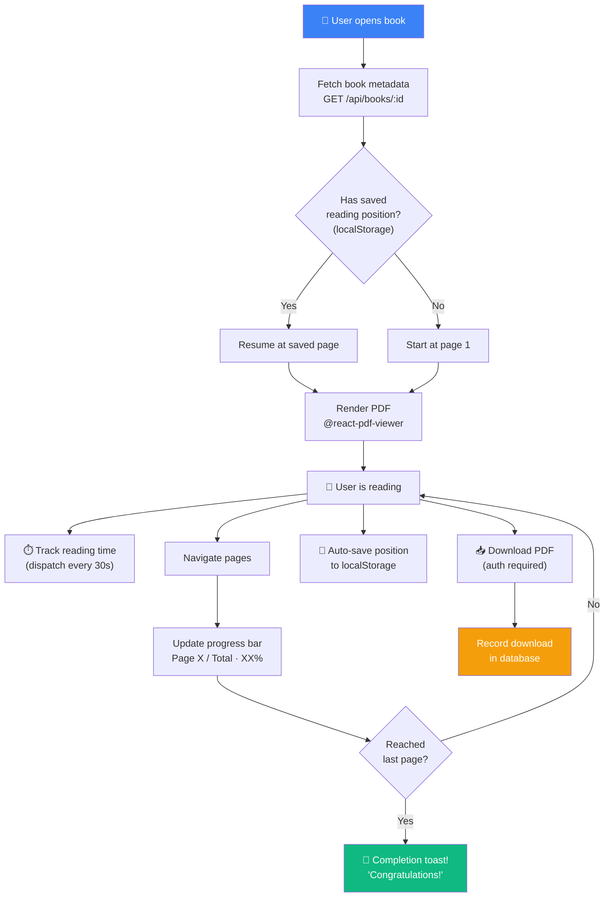

---

## 9. AI Recommendation Flow

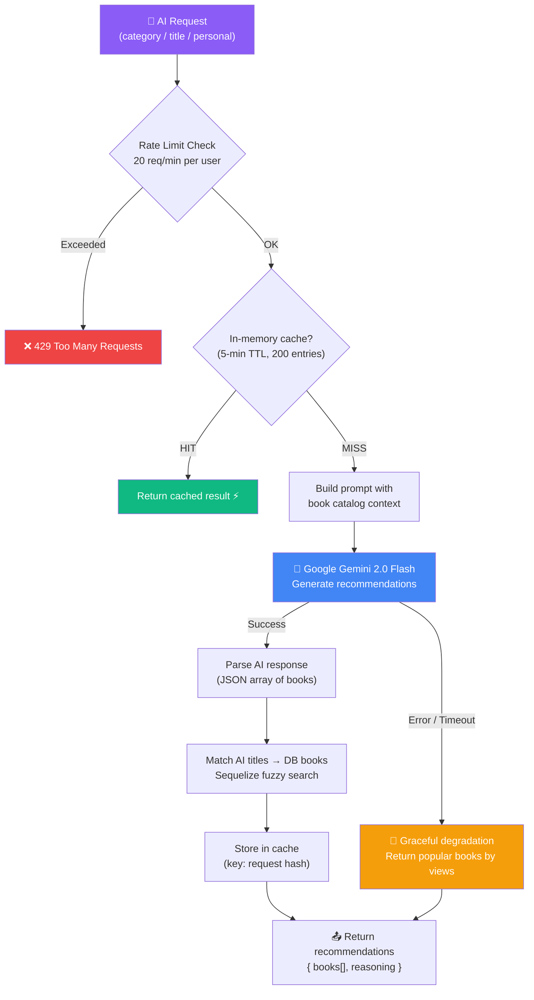

---

## 10. API Route Structure

```mermaid
graph LR
    API["/api"] --> AUTH["/auth"]
    API --> BOOKS["/books"]
    API --> REV["/reviews"]
    API --> FEED["/feedback"]
    API --> PUSH["/push"]
    API --> USERS["/users"]
    API --> ROLES["/roles"]
    API --> PERMS["/permissions"]
    API --> CAT["/categories"]
    API --> DEPT["/departments"]
    API --> MT["/material-types"]
    API --> PUB["/publishers"]
    API --> AUT["/authors"]
    API --> EDT["/editors"]
    API --> UPL["/uploads"]
    API --> STAT["/stats"]
    API --> ACT["/activities"]
    API --> AI["/ai/recommendations"]
    API --> SET["/settings"]
    API --> DL["/downloads"]

    AUTH --> A1["POST /register"]
    AUTH --> A2["POST /login"]
    AUTH --> A3["POST /refresh"]
    AUTH --> A4["GET /profile"]
    AUTH --> A5["PATCH /profile"]
    AUTH --> A6["PUT /change-password"]
    AUTH --> A7["POST /forgot-password"]
    AUTH --> A8["POST /verify-otp"]
    AUTH --> A9["POST /reset-password"]
    AUTH --> A10["POST /send-verification-email"]
    AUTH --> A11["GET /verify-email"]

    BOOKS --> B1["GET / (list + search)"]
    BOOKS --> B2["GET /:id"]
    BOOKS --> B3["POST / (create)"]
    BOOKS --> B4["PUT /:id (update)"]
    BOOKS --> B5["DELETE /:id (soft)"]
    BOOKS --> B6["GET /:id/cover"]
    BOOKS --> B7["GET /:id/download"]
    BOOKS --> B8["GET /:id/stream"]
    BOOKS --> B9["GET /:id/pdf-url"]
    BOOKS --> B10["POST /scan-search"]

    REV --> R1["GET /public (testimonials)"]
    REV --> R2["GET /my"]
    REV --> R3["GET /stats"]
    REV --> R4["GET / (admin list)"]
    REV --> R5["PUT /:id"]
    REV --> R6["DELETE /:id"]

    FEED --> F1["POST / (public/auth)"]
    FEED --> F2["GET / (admin list)"]
    FEED --> F3["PATCH /:id/status"]

    PUSH --> P1["POST /subscribe"]
    PUSH --> P2["POST /unsubscribe"]
    PUSH --> P3["GET /vapid-public-key"]

    AI --> AI1["GET /?category=..."]
    AI --> AI2["GET /?bookTitle=..."]
    AI --> AI3["GET /?userId=current"]
    AI --> AI4["GET /trending"]
    AI --> AI5["GET /similar/:bookId"]
    AI --> AI6["POST /personalized"]
    AI --> AI7["POST /chat"]

    UPL --> U1["POST /single"]
    UPL --> U2["POST /multiple"]
    UPL --> U3["DELETE /delete"]

    style API fill:#3b82f6,color:#fff
    style AUTH fill:#ef4444,color:#fff
    style BOOKS fill:#10b981,color:#fff
    style REV fill:#06b6d4,color:#fff
    style FEED fill:#14b8a6,color:#fff
    style PUSH fill:#22c55e,color:#fff
    style AI fill:#8b5cf6,color:#fff
    style UPL fill:#f97316,color:#fff
```

---

## 11. Admin Dashboard — Page Structure

```mermaid
graph TD
    ROOT["🖥️ Admin Dashboard<br/>admin-elibrary.samnangchan.shop"] --> LOGIN["/login<br/>Authentication"]
    ROOT --> DASH["/(dashboard)"]

    DASH --> OV["/overview<br/>📊 Stats · Charts · Activity"]
    DASH --> BK["/books<br/>📚 Book Management"]
    DASH --> US["/users<br/>👥 User Management"]
    DASH --> PR["/profile<br/>👤 My Profile"]
    DASH --> BL["/billing<br/>💳 Billing (placeholder)"]

    BK --> BK_LIST["Book List<br/>TanStack Table · Search · Filter"]
    BK --> BK_NEW["/books/new<br/>Create Book Form"]
    BK --> BK_EDIT["/books/:id/edit<br/>Edit Book Form"]
    BK --> CAT_M["/books/categories<br/>Category Manager"]
    BK --> DEPT_M["/books/departments<br/>Department Manager"]
    BK --> MT_M["/books/material-types<br/>Material Type Manager"]
    BK --> PUB_M["/books/publishers<br/>Publisher Manager"]
    BK --> AUT_M["/books/authors<br/>Author Manager"]
    BK --> EDT_M["/books/editors<br/>Editor Manager"]

    US --> US_LIST["User List<br/>Table · Search"]
    US --> US_NEW["/users/new<br/>Create User"]
    US --> US_EDIT["/users/:id/edit<br/>Edit User + Roles"]
    US --> ROLE_M["/users/roles<br/>Role Manager"]
    US --> PERM_M["/users/permissions<br/>Permission Manager"]

    OV --> OV_CARDS["Stat Cards<br/>Books · Theses · Members"]
    OV --> OV_CHART["Charts<br/>Upload Trends · Categories"]
    OV --> OV_ACT["Recent Activities<br/>Feed + Time Filter"]

    style ROOT fill:#8b5cf6,color:#fff
    style LOGIN fill:#ef4444,color:#fff
    style OV fill:#3b82f6,color:#fff
    style BK fill:#10b981,color:#fff
    style US fill:#f59e0b,color:#fff
```

---

## 12. Student Frontend — Page Structure

```mermaid
graph TD
    ROOT["📱 Student Frontend<br/>frontend.samnangchan.shop"] --> HOME["/<br/>🏠 Home Page"]
    ROOT --> AUTH_G["/auth"]
    ROOT --> BOOKS_G["/books"]
    ROOT --> LIB["/library<br/>📚 Personal Library"]
    ROOT --> PROF["/profile<br/>👤 Profile"]
    ROOT --> ABOUT["/about<br/>ℹ️ About"]
    ROOT --> CONTACT["/contact<br/>📧 Contact"]

    HOME --> HERO["Hero Section<br/>Search · Book Marquee"]
    HOME --> FEAT["Featured Books<br/>Top 15 · Rank Badges"]
    HOME --> STATS["Statistics<br/>Animated Counters"]
    HOME --> CATS["Categories<br/>Browse by Subject"]
    HOME --> TEST["Testimonials<br/>Carousel (from /api/reviews/public)"]
    HOME --> CTA["CTA Section"]

    AUTH_G --> SIGNIN["/auth/signin"]
    AUTH_G --> SIGNUP["/auth/signup"]
    AUTH_G --> FORGOT["/auth/forgot-password<br/>3-Step OTP Flow"]

    BOOKS_G --> CATALOG["/books<br/>Catalog · Grid/List"]
    BOOKS_G --> DETAIL["/books/:id<br/>Book Detail"]
    BOOKS_G --> READER["/books/:id/read<br/>📖 PDF Reader"]

    LIB --> FAV["⭐ Favorites Tab"]
    LIB --> HIST["📜 History Tab"]
    LIB --> PROG["📊 Progress Tab"]

    PROF --> P_VIEW["View Profile"]
    PROF --> P_EDIT["Edit Profile + Avatar"]
    PROF --> P_PASS["Change Password"]

    style ROOT fill:#3b82f6,color:#fff
    style HOME fill:#10b981,color:#fff
    style AUTH_G fill:#ef4444,color:#fff
    style BOOKS_G fill:#8b5cf6,color:#fff
    style LIB fill:#f59e0b,color:#fff
    style READER fill:#06b6d4,color:#fff
```

---

## 13. Redux State Architecture

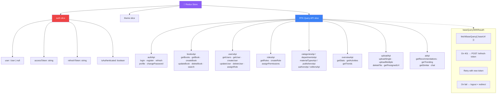

---

## 14. Sprint & Phase Timeline

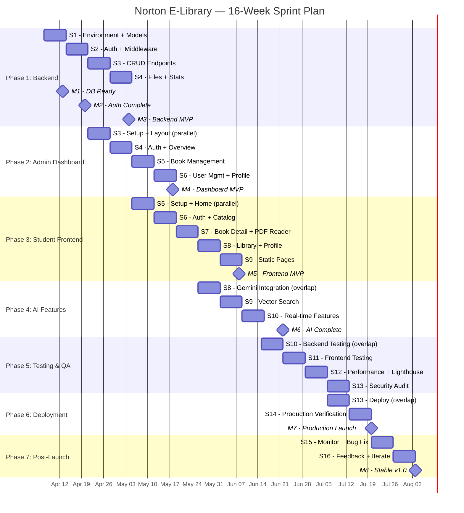

---

## 15. Data Flow — Book CRUD

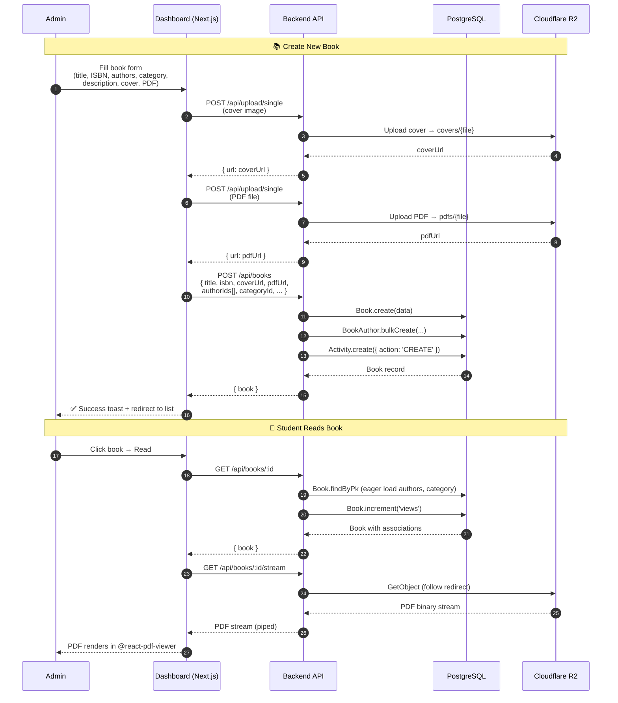

---

## 16. Level 0 DFD — Admin, Librarian & Student

> **គំនូសតាងទី៤.១ — លំហូទិន្ន័យថ្នាក់ស្រទាប់ 0 (Context Diagram)**  
> This context-level DFD shows the Norton E-Library system as a single process with the three external entities that interact with it: **Admin**, **Librarian**, and **User/Student**.

```mermaid
flowchart TB
    %% ── External Entities ──────────────────────────────────────────────────
    ADMIN(["👨‍💼 Admin"])
    LIB(["📚 Librarian"])
    STU(["👩‍🎓 User / Student"])

    %% ── Central System ─────────────────────────────────────────────────────
    SYS[["⚙️ Norton E-Library System\n(Web Application)"]]

    %% ── Data Stores ────────────────────────────────────────────────────────
    DS1[("🗄️ Database\n(PostgreSQL)")]
    DS2[("☁️ File Storage\n(Cloudflare R2)")]

    %% ════════════════════════════════════════════════════════════════════════
    %% ADMIN flows
    %% ════════════════════════════════════════════════════════════════════════
    ADMIN -- "Login credentials" --> SYS
    SYS -- "Auth token · Dashboard access" --> ADMIN

    ADMIN -- "Create / Edit / Delete users\nAssign roles & permissions" --> SYS
    SYS -- "User list · Role report\nActivity logs" --> ADMIN

    ADMIN -- "System settings · Announcements" --> SYS
    SYS -- "Settings confirmation\nAudit trail" --> ADMIN

    ADMIN -- "View statistics & analytics" --> SYS
    SYS -- "Stats dashboard\n(books · users · downloads · trends)" --> ADMIN

    %% ════════════════════════════════════════════════════════════════════════
    %% LIBRARIAN flows
    %% ════════════════════════════════════════════════════════════════════════
    LIB -- "Login credentials" --> SYS
    SYS -- "Auth token · Librarian dashboard" --> LIB

    LIB -- "Add / Edit / Delete books\n(title · ISBN · cover · PDF\nauthors · category · department)" --> SYS
    SYS -- "Book record confirmation\nUpload URLs" --> LIB

    LIB -- "Upload cover image & PDF" --> SYS
    SYS -- "Stored file URLs (R2)" --> LIB

    LIB -- "Manage categories · departments\npublishers · authors · editors" --> SYS
    SYS -- "Updated metadata lists" --> LIB

    LIB -- "View & moderate reviews\nManage feedback tickets" --> SYS
    SYS -- "Review list · Feedback reports" --> LIB

    %% ════════════════════════════════════════════════════════════════════════
    %% USER / STUDENT flows
    %% ════════════════════════════════════════════════════════════════════════
    STU -- "Register · Login credentials\n(username / email / student ID)" --> SYS
    SYS -- "Auth token · Profile data\nEmail verification OTP" --> STU

    STU -- "Search & browse books\n(keyword · category · department)" --> SYS
    SYS -- "Book catalog results\n(title · cover · metadata)" --> STU

    STU -- "Open / Read book (online)" --> SYS
    SYS -- "PDF stream · Reading progress saved" --> STU

    STU -- "Download book (PDF)" --> SYS
    SYS -- "PDF file · Download recorded" --> STU

    STU -- "Save book to favorites\nTrack reading history" --> SYS
    SYS -- "Personal library state\n(favorites · progress · history)" --> STU

    STU -- "Submit book review & rating" --> SYS
    SYS -- "Review confirmation\nAverage rating updated" --> STU

    STU -- "Submit feedback" --> SYS
    SYS -- "Feedback acknowledgement" --> STU

    STU -- "Request AI recommendation" --> SYS
    SYS -- "Personalised book suggestions\n(Gemini 2.0 Flash)" --> STU

    STU -- "Subscribe to push notifications" --> SYS
    SYS -- "Push notification alerts" --> STU

    %% ════════════════════════════════════════════════════════════════════════
    %% System ↔ Data Stores
    %% ════════════════════════════════════════════════════════════════════════
    SYS -- "Read / Write records\n(users · books · reviews\ndownloads · activities)" --> DS1
    DS1 -- "Stored data" --> SYS

    SYS -- "Upload / Retrieve files\n(PDFs · covers · avatars)" --> DS2
    DS2 -- "File URLs & binary streams" --> SYS

    %% ── Styles ─────────────────────────────────────────────────────────────
    style ADMIN  fill:#8b5cf6,stroke:#6d28d9,color:#fff
    style LIB    fill:#10b981,stroke:#059669,color:#fff
    style STU    fill:#3b82f6,stroke:#1d4ed8,color:#fff
    style SYS    fill:#1e293b,stroke:#334155,color:#fff
    style DS1    fill:#f59e0b,stroke:#d97706,color:#fff
    style DS2    fill:#06b6d4,stroke:#0891b2,color:#fff
```

### Flow Summary Table

| Actor | Inputs to System | Outputs from System |
|---|---|---|
| **Admin** | Login · User CRUD · Role assignment · System settings | Dashboard · User list · Audit logs · Statistics |
| **Librarian** | Login · Book CRUD · File uploads · Metadata management · Review moderation | Book confirmations · File URLs · Feedback reports |
| **User/Student** | Register/Login · Search · Read/Download · Review · Feedback · AI request · Push subscribe | Auth token · Book catalog · PDF stream · AI suggestions · Notifications |

---

> **📌 Rendering Tips:**  
> - **VS Code:** Install the "Markdown Preview Mermaid Support" extension  
> - **GitHub:** Mermaid diagrams render natively in `.md` files  
> - **Online:** Paste diagrams at [mermaid.live](https://mermaid.live)

> **© 2026 Norton University E-Library · Phnom Penh, Cambodia**
